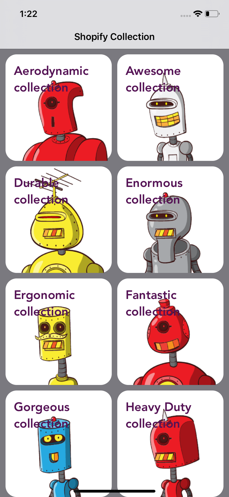

# Shopify Challenge

This iOS app was created for the iOS internship position

## Screenshots

 


## View the Project

```bash
git clone https://github.com/GirugaCode/Shopify-Challenge.git
```
Then install the Pod

```bash
pod install
```


## Pods and API

* Shopify API 
* Kingfisher - Libary for downloading and caching images  <https://github.com/onevcat/Kingfisher>


## Author

* Ryan Nguyen

